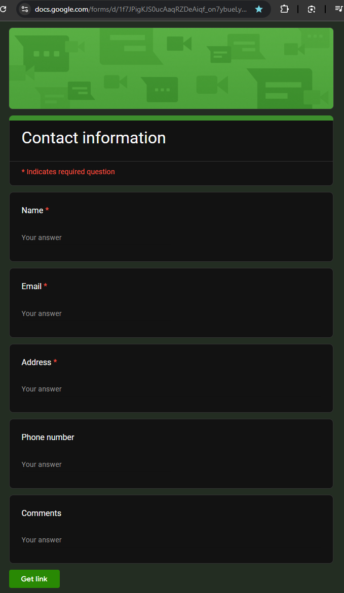
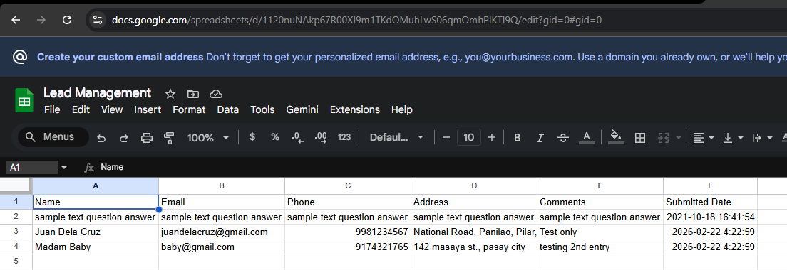

# Lead Auto-Reply & Logging Automation (lead-auto-reply-log-zap)

## Project Overview
This automation streamlines how small businesses handle new inquiries by sending an instant, professional email response and logging each lead automatically. It ensures fast communication, organized tracking, and a consistent customer experience.

## Problem It Solves
Many small businesses struggle to respond quickly to inquiries and maintain an organized record of leads. Manual replies take time, and tracking submissions across different channels can be inconsistent. This automation eliminates delays, reduces manual work, and centralizes lead information.

## Apps Used
- **Google Forms**
- **Google Sheets**
- **Gmail**

## Step-by-Step Workflow
1. **Trigger:** A new inquiry is submitted through Google Forms.  
2. **Action:** Zapier adds the lead details to a Google Sheets log.  
3. **Action:** A personalized auto-reply email is sent to the lead.    

## Screenshots
AI Workflow

Google Form

Note:The ‘Get link’ option appears because I’ve already submitted a response. New users who haven’t responded yet will see a ‘Submit’ button instead.

Google Sheets

Gmail Auto-reply

## Notes on Customization
- You can replace Google Forms with Typeform, Jotform, or Webflow Forms.  
- The auto-reply email can be customized with branding, templates, or conditional messaging.  
- Add filters or paths if you want different responses based on inquiry type.  
- Integrate with CRMs like HubSpot or Zoho for advanced lead management.  
- Slack or SMS notifications can be added for real-time alerts.
